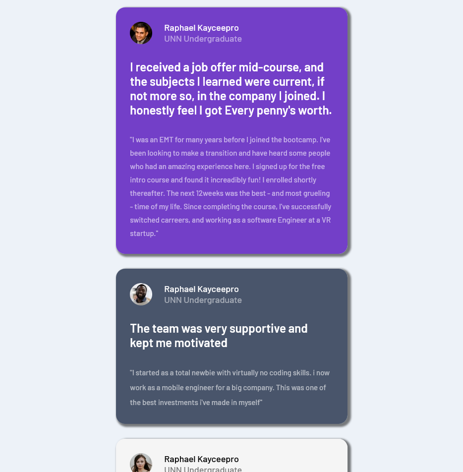
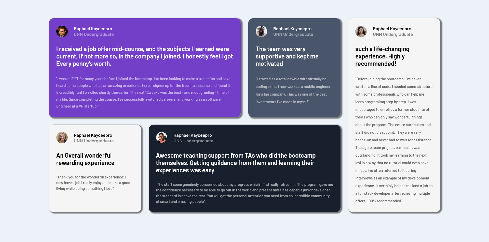

# Frontend Mentor - Testimonials grid section solution

This is a solution to the [Testimonials grid section challenge on Frontend Mentor](https://www.frontendmentor.io/challenges/testimonials-grid-section-Nnw6J7Un7). Frontend Mentor challenges help you improve your coding skills by building realistic projects.

## Table of contents

- [Overview](#overview)
  - [The challenge](#the-challenge)
  - [Screenshot](#screenshot)
  - [Links](#links)
- [My process](#my-process)
  - [Built with](#built-with)
  - [What I learned](#what-i-learned)
  - [Continued development](#continued-development)
  - [Useful resources](#useful-resources)
- [Author](#author)
- [Acknowledgments](#acknowledgments)

## Overview

### The challenge

Users should be able to:

- View the optimal layout for the site depending on their device's screen size

### Screenshot




### Links

- Solution URL: [Github](https://github.com/grid-task)
- Live Site URL: [Add live site URL here](twitter.com/nwabunwanne4u/)

## My process

### Built with

- Semantic HTML5 markup
- CSS custom properties
- Flexbox
- CSS Grid
- SCSS
- Mobile-first workflow

### What I learned

I am now able to work with grid and flex and i added shadow to the individual grid item

```html
<div class="grid-purple box"></div>
```

```css
.proud-of-this-css {
  color: papayawhip;
}
```

```css
box-shadow: 3px 2px 2px 2px rgba(0, 0, 0, 0.5);
```

### Continued development

as i progress i wish to advance more on the building and making it as much interacrive as it can with css and javasceipt

### Useful resources

-
- [code 365](https://www.twitter.com/365Code_) - This helped me by giving me this as task as a way to grow and develop
- [stack overflow](https://www.stackoverflow.com) - This is an amazing article which helped me finally understand grid and flexbox. I'd recommend it to anyone still learning this concept.

## Author

- Website - [Kayceepro](https://www.github.com/kayceepro)
- Frontend Mentor - [@yourusername](https://www.frontendmentor.io/profile/yourusername)
- Twitter - [@nwabunwanne4u](https://www.twitter.com/nwabunwanne4u)

## Acknowledgments

thanks to mr. Igwe henry, Mark and Alvin Veri5ied in one way or the other i've gain motivation from you and to be honest, you are the best
